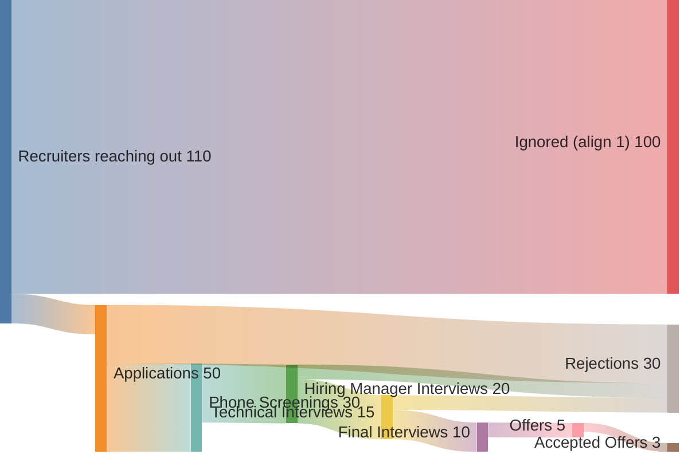

# Intro
Got a Mac and keep all your emails in Apple Mail? Want to summarize all your job application emails? This script is for you!

Very simple string matching for now, based on the subject line of the email, via the [emlx](https://github.com/mikez/emlx) module in Python.

# Usage
1. Clone this repo
2. create a .env file in the root directory with the following variables:
```
EMAIL_ADDRESS=your_email_address
```
3. Run `uv run src/email_job_application_tracking.py` in the terminal

# Future
Stages:
1. requests to apply
2. applications
3. phone screenings
4. hiring manager interviews
5. technical interviews
6. final interviews
7. offers
8. accepted offers
- rejection emails

example sankey:
